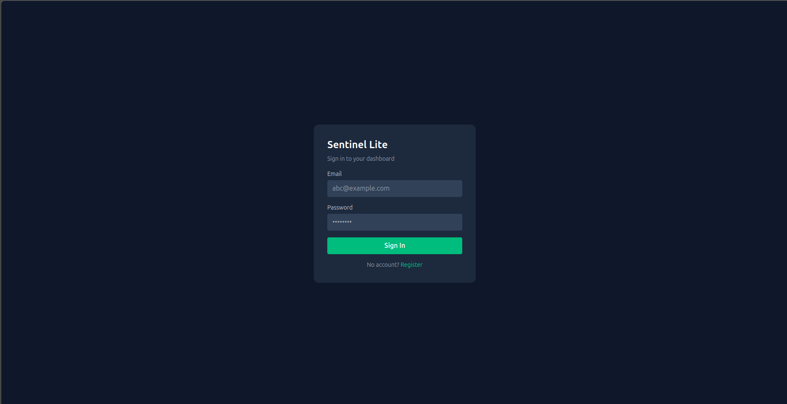
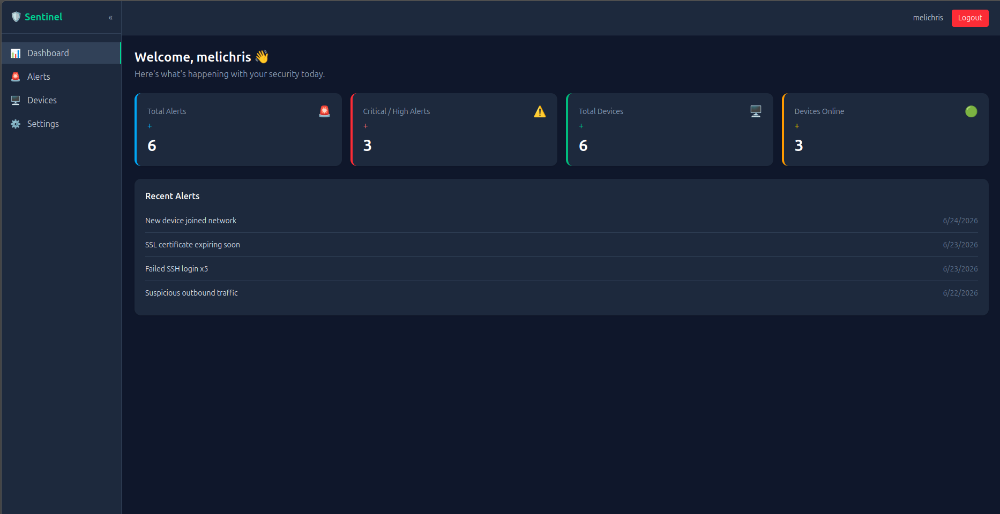
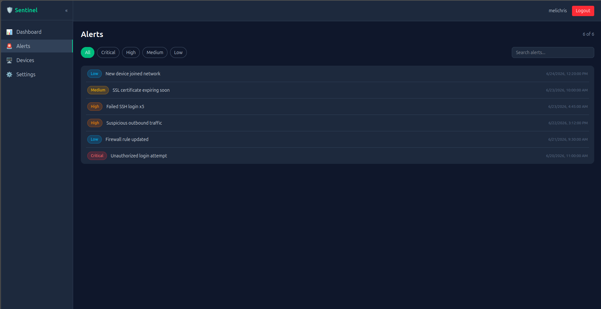

# Sentinel Lite

Sentinel Lite is a lightweight security dashboard that simulates monitoring of user access and system activity.

## 🚀 Features
- Authentication (JWT-based)
- Protected routes
- Dashboard interface
- API integration

## 🛠 Tech Stack
- Vue 3
- Vue Router
- Axios
- Node.js (backend)

## 📸 Screenshots






## ⚙️ Setup
npm install
npm run dev

## Project Setup

```sh
npm install
```

### Compile and Hot-Reload for Development

```sh
npm run dev
```

### Compile and Minify for Production

```sh
npm run build
```
# sentinel-lite


